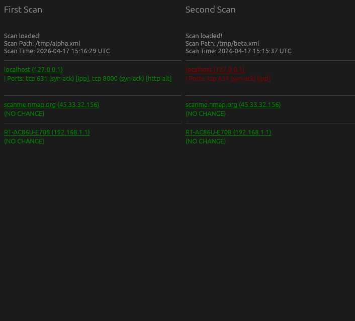

# ndiff-rs

Nmap diffing tool that uses the [nmap_xml_parser](https://crates.io/crates/nmap_xml_parser) crate to display the significant differences between two scans in XML format. It also has a GUI mode based on [egui](https://github.com/emilk/egui):

## TODO

- Replace calls to RFD with [async equivalent](https://docs.rs/rfd/latest/rfd/struct.AsyncFileDialog.html) to avoid hanging the GUI
